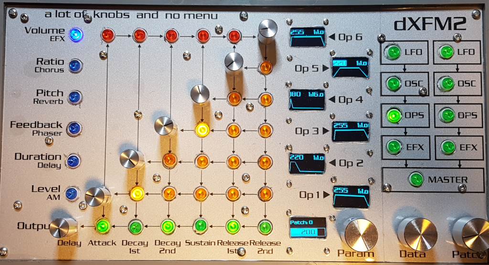

# dXFM2

A FM synthesizer with a lot of knobs and no menu!

Always wanted to create lush FM sounds? But to afraid of the menu-driven horrors of FM synthesizers, like the illustrious Yamaha DX7?

The dXFM2 aims to be just that: an FM synthesizer, with the physical feel of an analog synthesizer: a lot of knobs and no menu.

The dXFM2 is based on the incredible work of René Ceballos. He created the the codebase for a 64-voice, 2-part, 6-operator FM synthesizer with built-in effects processor, built on an FPGA chip. You can find all te information at [www.futur3soundz.com](https://www.futur3soundz.com/xfm2). The dXFM2 complements this with the physical controls for the FPGA chip, management by a Teensy 4.0.

## Build description

All build descriptions can be found here. Please note that this is a somewhat free-format description and not intended as build instructions: most thing I just found out on-the-fly, so some descriptions might not be completely correct any more.

## Concept of the synth

I always wanted to have an FM synth that I could "understand" just from looking at the display. I do understand the concepts of FM synthesis: carriers that are modulated by modulators. But in most FM synthesizers, it is not clear *which* operator is a carrier and *which* operator is a modulator, and to what extend. The dXFM2 overcomes this problem:

- Every operator corresponds to exactly one dial (the 1 knob for 1 function principe);
- The output of the synth also corresponds to exactly one dial;
- A green LED indicates that the operator in that column is a **carrier** (follow the arrows);
- A yellow LED indicates that the operator in that column is a **modulator** for the operator in the corresponding row;
- A red LED indicates that the operator in that column is a **modulator** for operator 6, notably creating a feedback loop.

This LED-matrix makes the carrier-modulator algorithm visible in a what-you-see-is-what-you-get kind of way. And you can change this on the fly, just by pressing the LED (it's actually a push button).

Some other parameters are very important for the FM sound synthesis:
- The level of the operator;
- The amplitude envelope shape;
- The ratio between operators;
- Whether an operator is modulating itself (feedback).

An as you can see: every operator has its own small LED screen that displays just this information. The seventh LED screen depicts global information, or in this case: the out volume and the active patch.

## Operating the dXFM2
Although the sound of the FM synthesizer is pretty much *in your face*, the manipulation of that sound does actually involve a bit of menu's. For this, you use the green LED buttons on the right side of the synthesizer, selecting a specific page. This activates a particular set of options, which you can further select by using the blue LED buttons on the left side of the synthesizer.

When you look at the green LED buttons, you see that two rows of identical options are available. The dXFM2 has two identifical FM synth units, and by selected between the left or right column, you select the unit for which you want to change a parameter.

- **LFO** will enable the parameter page for the low frequency oscillator;
- **OSC** will enable the parameter page for the sound oscillators;
- **OPS** will enable the parameter page for the operators (selected by default);
- **EFX** will enable the parameter page for the effects;
- **MASTER** will enable the parameter page for some global parameters.

And if you really want to do some menu-diving, three additional dials are available:
- The **Param** dial gives you access to a regular menu. From this menu, you can change some more exotic parameters or have some extra options to ease the workflow while shaping FM sounds.
- With the **Data** dial you change some parameter value, as selected with the Param dial.
- With the **Patch** dial you activate a previously stored patch from the XFM2 memory banks (127 patches are available). Select a patch by turning the dial, and activate a patch by pushing the dial (all dials are actually push buttons as well as encoders).
